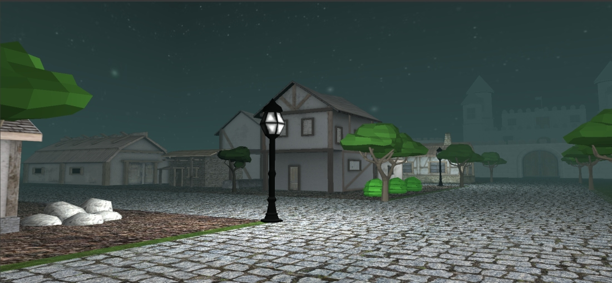
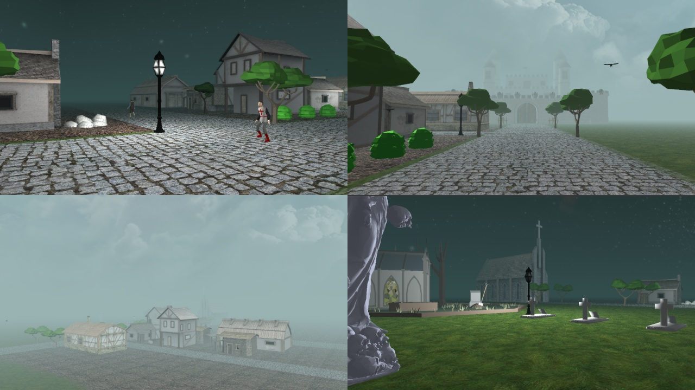
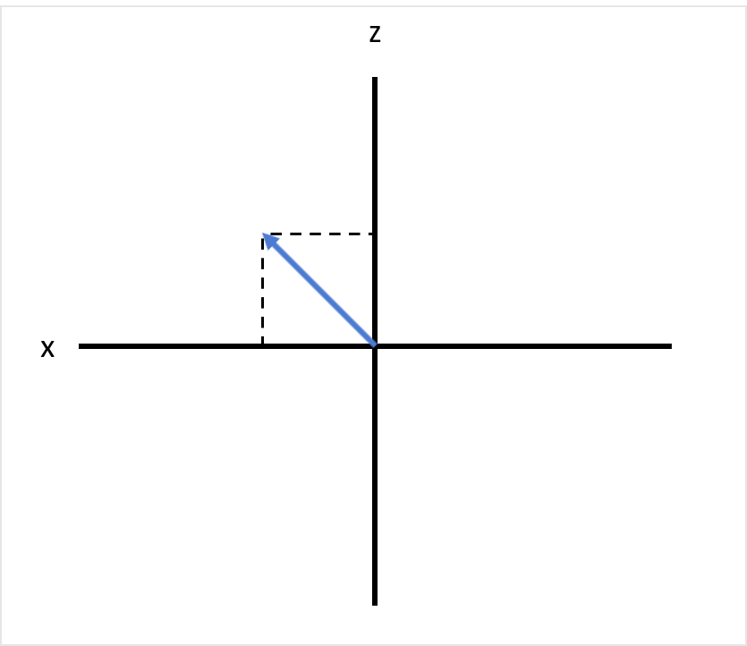
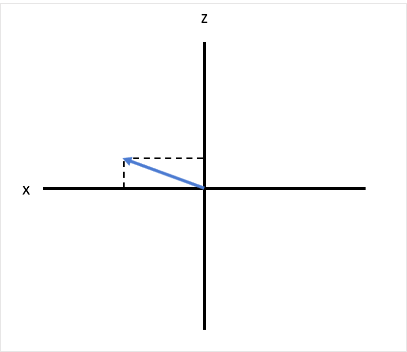
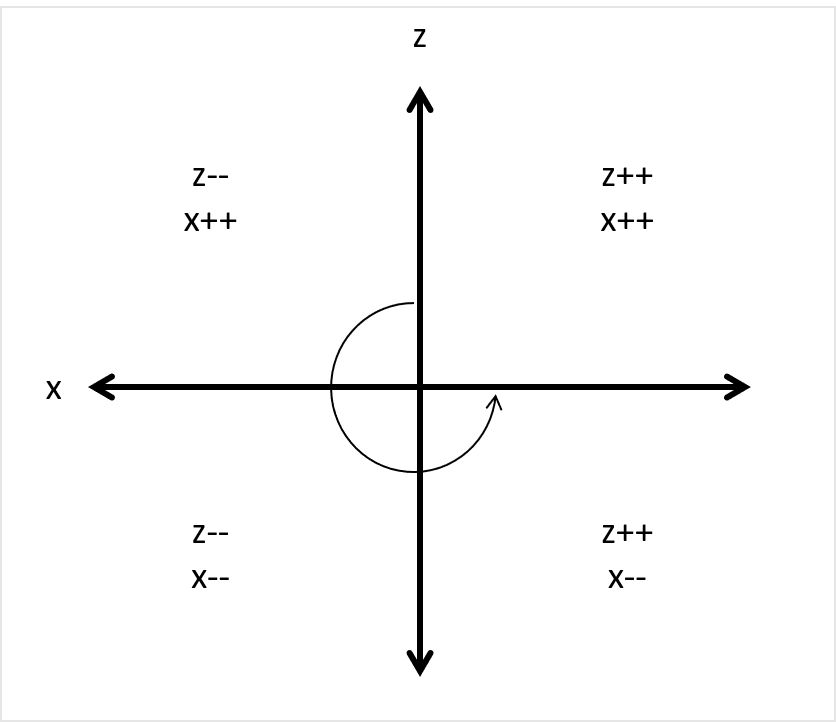
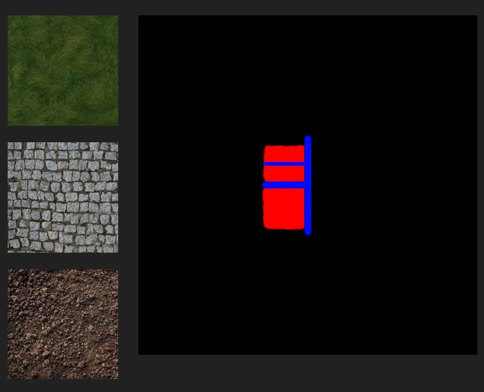
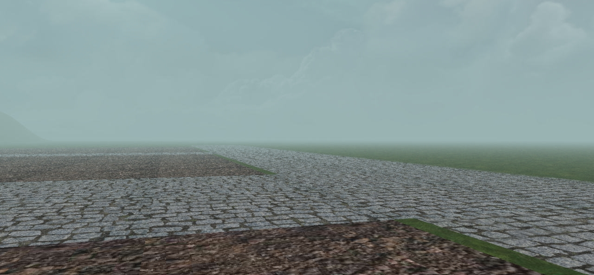

# 3D Graphics Project
Medieval scene based project for the 3D Graphics course of M1 MoSIG

<p align="center">

</p>

## 1. How to run

In the 3d-graphics-project/src folder, execute the `main.py` file:

```
python3 main.py
```

Welcome to our empire. You can roam all over the places using the following keys (English Keyboard), (or ZQSD for French keyboard):
* W: Move Forward
* A: Move Left
* S: Move Backward
* D: Move Right
* UP: To look upwards
* DOWN: Return to original state from UP
* RIGHT: To turn right
* LEFT: To turn left

Roam into our kingdom to watch the green meadows, huge castle, a church, a graveyard, houses with farms, farmers and templars roaming in the streets. Look up to see flock of birds flying in the sky. You can also fire a cannon ball from the cannon tower by pressing 'F' key. Enjoy roaming in our kingdoms as days and night will pass by. Remember to look up into the starry night sky. And use you earphones while pressing 'F' key. Now we will let you explore our kingdom.

## 2. Authors

* Archit YADAV
* Jit CHATTERJEE
* Nairit BANDYOPADHYAY

## 3. Installation

### 3.1 Minimum requirements

The following libraries need to be installed for running the application. They can also be found in `requirements.txt` file, and installed using `pip3 install -r requirements.txt`
```
AssimpCy
glfw
numpy
Pillow
PyOpenGL
PyOpenGL-accelerate
simpleaudio
```

### 3.2 Extra libraries

In case OpenGL and other bare minimum is already installed, simply install simpleaudio library as follows:

`pip3 install simpleaudio`

In case of the following missing file error:

```
fatal error: alsa/asoundlib.h: No such file or directory
```
* install `libasound2`
    * `sudo apt-get install libasound2-dev`

__NOTE:__ For WSL + x11 case, there *might* be an issue during runtime even after correctly installing the sound libraries, because of x11 sound forwarding issues, for which we currently do not have a concrete solution.

As a solution to disable all the game sound components (and hence not use `simpleaudio` library at all), simple navigate to `src/config.py` and change the value of `sound` variable to `False`. This will disable all the calls to `simpleaudio` objects as well as the import statement itself.


## 4. List of features

* Modelling
    * Hierarchical modelling
    * Mesh based objects
    * Non-flat ground

* Rendering
    * Light and materials
        * Phong Effect
        * Lambertian Effect
        * Multiple Point Light Effects 
        * Point Light Attenuation
    * Texture based objects
    * Novel rendering effects:
        * Fog
        * Blendmap
        * Terrain collision detection
        * Day-night transition, with change in fog colour
    * Skybox
        * Multi-skybox support (day/night)

* Animation
    * Keyframe-only animation
    * Procedural animation
        * Birds (Boids) circling over the sky in random fashion
    * Skinning + keyframe
        * Farmer/templar walking on a defined path
    * Keyboard control element
        * Cannon firing using F key
        * Day-night cycle control using F6/F7/F8

## 5. Who did what
All of us were involved in a mix of features.


## 6. Difficulties

* Normal mapping - We attempted to implement normal mapping. We even had done an implementation which would calculate the tangents and bitangents, but the object wouldn't display at all at runtime. This is a feature which we would like to have it implemented sometime in future, when we'd have more time to properly work on it.

* Real-time based Point light effects - It took a lot of time to properly understand how to create 4 different sources of light, and how all the objects would be affected by these, that too in accordance with the time of the day.

## 7. Improvements

* Bloom Effect
* Shadow Effect
* PBR

## 8. Screenshots

<p align="center">

</p>

---

## 9. Description
### 9.1 Camera

We defined a camera class which would help us with managing all the variables and functions associated with moving around the camera POV in our scene.

The following variables define the camera related data:

* `camera_pos` - defines the initial starting position of the camera in 3 dimensions (x, y, z).
* `up` - defines the up direction (the positive y axis as per convention), so we define it as (0, 1, 0)
* `camera_front` - defines the vector of direction the camera POV would be pointing at in the scene. We initialized it to (0, 0, 1) to point it along the z axis.

We define a `function process_keyboard_input()`, which would take action based on the key pressed by the user. For the physical displacement-based movement, we make use of WASD keys. For rotating the camera view along the sides, we use left and right arrow keys.

#### **Moving the camera (Translation)**

For the forward and backwards motion, we essentially modify the camera's position, `camera_pos` variable by a factor which incorporates speed of camera movement, `camera_speed `(calculated by `factor * delta_time`, where delta_time is calculated in order to make the calculation system independent), and the front facing vector direction of camera, `camera_front`. The resultant is either added or subtracted, depending upon forward or backward movement.

For the left and right movement, we have to perform a cross product (between forward direction vector and the up vector) in order to first create the right vector, and then incorporate the same `camera_speed` factor. The resultant is either added or subtracted, depending upon left or right movement.

#### **Moving the camera around (Rotation)**

In order to look left or right from camera POV (rotate the camera POV in a 2D plane CW or ACW), we make use of following diagram to understand the vectors involved:
<p align="center">


</p>

Any vector will be made up by its two constituent components, x and z. If both the components are equal, the vector will point exactly in between them (left figure). In order for the vector to point closer to x axis, the x component will have to increased, AND the z component will have to decreased at the same time (right figure).

So the idea is to increase/decrease the x and z components in unison, depending upon which direction we want the camera POV to rotate, and also in which quadrant the vector currently is in. If let's say, we are rotating along left side (anti-clockwise), a visual representation of all the cases for updating the front facing camera (`camera_front`)'s components is presented as follows:

<p align="center">

</p>

For right side rotation (clockwise), all the signs will be just reversed.

### 9.2 Skybox
We provided the functionality of 2 skyboxes - a day skybox with clouds and sun, and a night skybox with stars and planets. The skybox texture images were provided by the youtuber ThinMatrix.

[Day skybox textures](https://www.dropbox.com/sh/phslacd8v9i17wb/AABui_-C-yhKvZ1H2wb3NykIa?dl=0)  
[Night skybox textures](https://www.dropbox.com/sh/o7ozx1u5qlg7b5v/AACI3zt1a9ZMw5MG2G_rzbKda?dl=0)

We essentially load both the skybox textures in the Python code, and send them to the shaders, wherein we blend both the skybox in the ratio of a blend factor. The blend factor has values in the range of 0 to 1.

### 9.3 Terrain

We made use of `TexturedPlane` class in order to render grass of sufficient area in our scene. The grass would repeat itself, giving the illusion of a large available area. In order to support multiple textures on a single terrain (aka multi-texturing), we created a blendmap using GIMP, using which we can tell OpenGL which texture to render at what places.

<p align="center">

</p>

The grass went to the black region, the pavement texture is mapped to blue region, and the soil texture is mapped to red region, giving us a blend of textures on the ground.

<p align="center">

</p>

### 9.4 3D Objects

3D models of type `.obj` and `.fbx` both are supported by the object loader. Both require the texture images also to be placed along with object file in the same directory.

`Node` class was made use of in order to define the properties of our objects. We can `scale`, `translate` and `rotate` the object however we want, meaning we can place our object anywhere in our skybox

TODO: Write about multi-texture vs single texture based objects, as well as animated objects.

### 9.5 Audio

Simpleaudio library,
Found from this link: https://stackoverflow.com/a/36284043/6475377

In case of the following missing file error:

`fatal error: alsa/asoundlib.h: No such file or directory`

* install `libasound2`

    * `sudo apt-get install libasound2-dev`

#### Usage

```py
import simpleaudio as sa

wave_obj = sa.WaveObject.from_wave_file("path/to/file.wav")
play_obj = wave_obj.play()
# play_obj.wait_done()
```
`play_obj.wait_done()` is removed so that audio plays in non-blocking manner.


